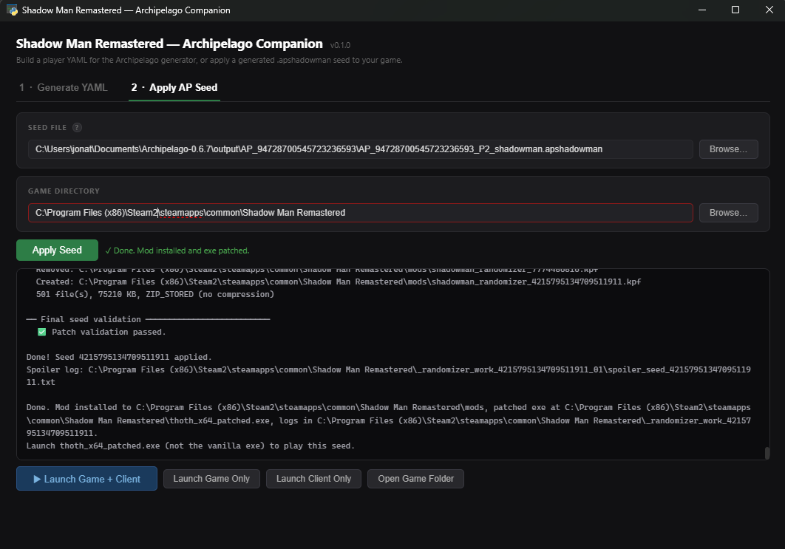
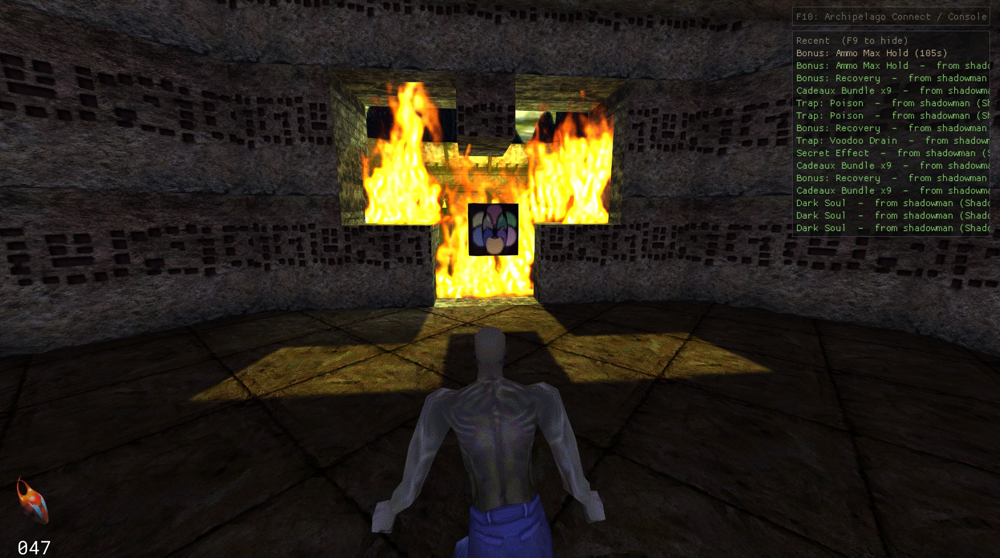
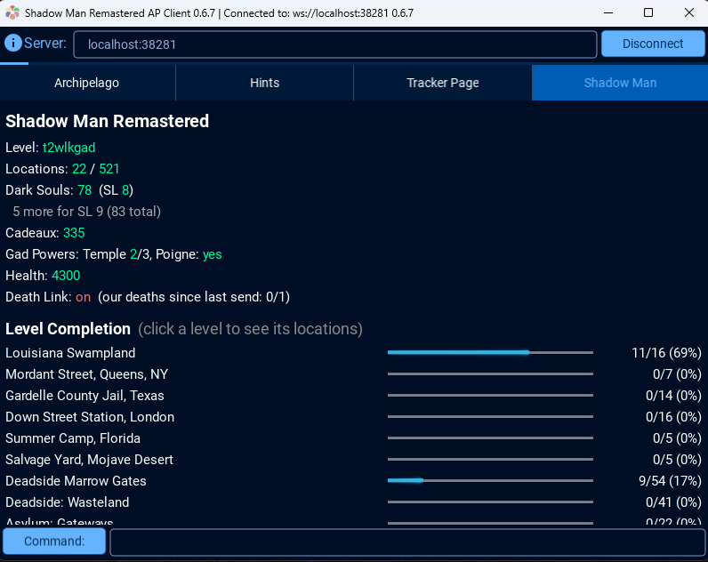
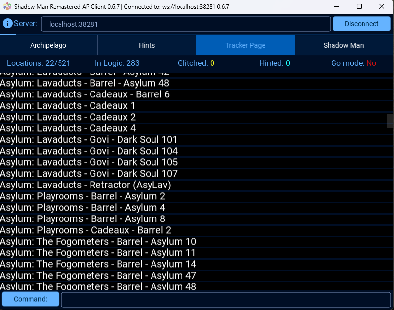

# Shadow Man Remastered Setup Guide

Game: Shadow Man Remastered (Steam)

## Goal

Defeat Legion. Reaching him requires collecting enough Dark Souls to open
the coffin gates blocking Deadside progress and completing the five Engine
Blocks (or, if `piston_combos` is enabled, also finding and reading Jack's
Schematic to learn that seed's randomized piston combination). Your client
reports `goal complete` automatically the moment Legion is confirmed dead —
no manual `!goal` needed.

## Installation

1. Install Archipelago.
2. Install this world: download `shadowman.apworld` from
   [this repo's releases page](https://github.com/bropacman/shadow-man-remastered-ap-world/releases)
   and drop it into your Archipelago install's `custom_worlds` folder (or
   use the Archipelago Launcher's own "Install APWorld" button, if it
   has one).

   While you're in there, it's worth also grabbing
   [Universal Tracker](https://github.com/FarisTheAce/UniversalTracker)'s
   `.apworld` and installing it the same way — entirely optional, but it
   needs to already be installed the first time you launch the client for
   its "Tracker Page" tab to show up (see "Tracking your progress" below),
   so it's easiest to just grab both now rather than backfilling it later.
3. Get a player YAML for this game. Easiest path: grab
   `shadow_man_ap_companion.exe` from the
   [shadow-man-remastered-randomizer releases page](https://github.com/bropacman/shadow-man-remastered-randomizer/releases)
   — a standalone Windows exe, no Python install needed — and use its
   "Generate YAML" tab for a GUI with tooltips for every option and a live
   YAML preview as you toggle things:

   
   

   You can also write a YAML by hand (see `options.py` in this world for
   every available setting, or the Archipelago website's YAML generator),
   or run the same tool from source (`ap_gui.py` in the
   shadow-man-remastered-randomizer repo) if you'd rather not use the
   prebuilt exe.
4. Submit your YAML to the room you're generating (AP website multiworld
   generator, or your own local `Generate.py` run) like any other AP game.
   No local game install is needed for this step.
5. After generation, download your output zip and find the file named
   `AP_<seed>_P<n>_<yourname>.apshadowman` inside it. This is a small JSON
   file — safe to share, contains no game files, just your placement data.
6. Apply it to your game with the same AP Companion tool's "Apply AP Seed"
   tab (no separate install needed if you're already using the exe from
   step 3):

   

   Or, from source: install the shadow-man-remastered-randomizer repo
   locally (this is where the actual game patching happens) and run:

   ```
   python apply_ap_seed.py path/to/your.apshadowman --game-dir "C:/path/to/Shadow Man Remastered"
   ```
7. This patches your local copy: writes a `thoth_x64_patched.exe`, installs
   a mod KPF, and writes a spoiler log / object map / soul threshold JSON
   into `<game-dir>/randomizer_output`. Launch `thoth_x64_patched.exe` (not
   the vanilla exe) to play your seed.
8. Start and connect the client: open the Archipelago Launcher you already
   have from installing Archipelago (Start Menu shortcut, or
   `ArchipelagoLauncher.exe` in your Archipelago install folder) and click
   **Shadow Man Remastered Client** from its list — this works the same
   way for everyone, no Python or source checkout needed, since it's just
   Archipelago's own launcher recognizing this world. The AP Companion's
   "Apply AP Seed" tab has the same thing built in too ("Launch Game +
   Client" / "Launch Client Only") — it auto-detects a normal Archipelago
   install, so those buttons should just work with nothing to configure;
   if they're greyed out, set the Archipelago Checkout field above them to
   wherever Archipelago lives on your PC. AP location checks use a custom
   "Book of AP" item model in-world, distinct from vanilla pickups:

   

   That in-game popup and recent-items log come from an injected overlay
   DLL — if Windows Smart App Control is on, it'll likely block it (see
   Known Issues below). Everything else (checks, connection, the client's
   own tracker tab) works fine either way; you'll just be missing the
   in-game popups.

You can re-run step 6 any time — it always re-patches from the same
`.apshadowman` file, so nothing is lost if you reinstall or verify game
files through Steam.

## Known Issues

- **This is a beta, solo-tested only** — please report anything odd (see
  the README's Contributing section).
- **Windows Smart App Control blocks the overlay popup DLL on a clean
  Windows 11 install.** `ShadowManOverlay.dll` (the thing that draws the
  in-game item popups and recent-items log shown above) is unsigned, so a
  system with Smart App Control on will silently block it from loading —
  you'll still get full location checks and tracking, just no in-game
  popups. Smart App Control has no per-app exception (it's all-or-nothing
  at the Windows level), so if you want the popups, either turn it off
  entirely (Windows Security → App & browser control → Smart App Control
  → Off — reversible without reinstalling Windows on an up-to-date
  system) or switch it to Evaluation mode, which logs instead of blocking.
- Cadeaux counting is not fully reliable — some cadeaux may not register
  in-game depending on how they were placed. Lowering the altar cost and
  Fogometers door from their defaults is recommended until this is
  resolved.

## Tracking your progress

The Shadow Man AP client's own "Shadow Man" tab shows your overall status
(level, locations checked, Dark Souls/Soul Level, Cadeaux, Gad Powers,
health, Death Link) plus a per-level completion breakdown:



Scroll down on that same tab for "Proximity to Go Mode" — a checklist of
your remaining goal prerequisites and live Engine Block region
reachability, so you can see exactly what's standing between you and
Legion:


The client also has full [Universal Tracker](https://github.com/FarisTheAce/UniversalTracker)
integration when its apworld is installed alongside this one — a "Tracker
Page" tab listing every location and whether it's currently in logic:


